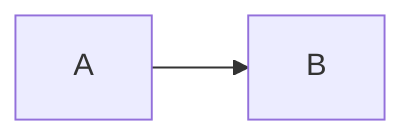

# md-preview reference

Complete interface for md-preview 0.0.3. For installation and a quick start
see [README.md](README.md).

- [Command line](#command-line)
- [Environment variables](#environment-variables)
- [Files and directories](#files-and-directories)
- [How serve works](#how-serve-works)
- [Markdown dialect](#markdown-dialect)
- [Math (KaTeX)](#math-katex)
- [Diagrams (mermaid)](#diagrams-mermaid)
- [Frontmatter](#frontmatter)
- [Page enhancements](#page-enhancements)
- [Template variables](#template-variables)
- [Lua filter](#lua-filter)
- [Styling](#styling)
- [Emacs package](#emacs-package)
- [Exit status](#exit-status)
- [Known limitations](#known-limitations)

## Command line

```
md-preview [serve] [options] FILE.md [-- PANDOC-ARGS...]
md-preview build   [options] FILE.md [-- PANDOC-ARGS...]
md-preview fetch   [--force]
md-preview assets  DIR
md-preview doctor
md-preview help | version
```

If the first argument isn't a subcommand, `serve` is assumed, so
`md-preview FILE.md` is the same as `md-preview serve FILE.md`.

### `serve`

Renders `FILE.md` and serves it with browser-sync. It re-renders on every
change and reloads the browser. Runs in the foreground until it gets
`SIGINT`, `SIGTERM` or `SIGHUP`.

| Option               | Default           | Meaning                                              |
|----------------------|-------------------|------------------------------------------------------|
| `-p`, `--port N`     | 3000, or next free | browser-sync port                                   |
| `-b`, `--browser NAME` | system default  | browser to open, passed to browser-sync `--browser`  |
| `--no-open`          | open              | don't open a browser; the URL is printed as `Local: http://…` |
| `--listen ADDR`      | `localhost`       | address to bind; `0.0.0.0` exposes it on the LAN    |
| `-- ARGS…`           |                   | everything after `--` goes to pandoc verbatim       |

### `build`

Renders `FILE.md` once and exits.

| Option               | Default                 | Meaning                                 |
|----------------------|-------------------------|-----------------------------------------|
| `-o`, `--output FILE` | `FILE.html` next to the input | output path; `-` writes to stdout |
| `--embed`            | off                     | self-contained HTML (pandoc `--embed-resources`): CSS, KaTeX with fonts, mermaid and images are inlined. About 7 MB when the document has diagrams |
| `--assets PREFIX`    | —                       | link the stylesheet, KaTeX and mermaid relative to `PREFIX/` (for publishing; lay them out with `md-preview assets`). Can't be combined with `--embed` |
| `-- ARGS…`           |                         | extra pandoc arguments                  |

With neither `--embed` nor `--assets`, the page links to the stylesheet
and to local KaTeX and mermaid by absolute filesystem path. So it works
when opened from disk on the same machine, but isn't portable. Relative image links are
kept as written, so they only resolve if the output sits next to the
Markdown file (the default).

### `fetch`

Downloads KaTeX (the npm tarball's `dist/`) and `mermaid.min.js` into
`$MD_PREVIEW_DATA/vendor/`. Skips anything already present unless
`--force` is given. Requires `curl` and `tar`.

### `assets`

Copies what `build --assets PREFIX` pages link to into `DIR`, the
directory that `PREFIX` points at:

```
DIR/share/style.css
DIR/share/md-preview.js
DIR/vendor/katex/…          only if fetched; otherwise pages use the CDN
DIR/vendor/mermaid/…
```

Symlinks are dereferenced, so `DIR` can be uploaded as-is.

### `doctor`

Prints the location and version of each dependency and asset. Exits with
1 if something required is missing.

### Examples

```sh
md-preview notes.md
md-preview serve --port 4000 --browser firefox notes.md
md-preview serve --no-open notes.md -- --toc --number-sections
md-preview build --embed notes.md -o ~/share/notes.html
md-preview build --assets _md-preview notes.md -o public/index.html
md-preview assets public/_md-preview
md-preview build notes.md -o - | wc -c
```

## Environment variables

| Variable                      | Default                                      | Meaning |
|-------------------------------|----------------------------------------------|---------|
| `MD_PREVIEW_FROM`             | `markdown+tex_math_single_backslash+alerts+mark+emoji` | pandoc input format and extensions |
| `MD_PREVIEW_PANDOC_ARGS`      | —                                            | extra pandoc arguments for every render, split on whitespace (e.g. `--toc --number-sections`) |
| `MD_PREVIEW_FRONTMATTER`      | unset                                        | frontmatter table: `open`, `closed` or `hide`. Overrides the document's own `md-preview-frontmatter` key. If neither is set, `closed` |
| `MD_PREVIEW_TOC`              | unset                                        | table of contents: `true` or `false`. Overrides the document's own `md-preview-toc` key. If neither is set, shown when the page has 3 or more headings |
| `MD_PREVIEW_LISTEN`           | `localhost`                                  | default for `serve --listen` |
| `MD_PREVIEW_BROWSER_SYNC`     | found on `PATH`, then via nvm                | path to the browser-sync executable |
| `MD_PREVIEW_NVM_VERSION`      | `stable`                                     | version passed to `nvm use` when searching nvm |
| `MD_PREVIEW_DATA`             | `${XDG_DATA_HOME:-~/.local/share}/md-preview` | data directory (holds `vendor/`; copied by `assets`) |
| `MD_PREVIEW_SHARE`            | `<script dir>/../share/md-preview`           | template, filter and stylesheet directory |
| `MD_PREVIEW_KATEX_VERSION`    | `0.18.9`                                     | KaTeX version for `fetch` and the CDN fallback |
| `MD_PREVIEW_MERMAID_VERSION`  | `12.0.0`                                     | mermaid version for `fetch` and the CDN fallback |
| `NVM_DIR`                     | —                                            | checked first when looking for `nvm.sh` |
| `XDG_RUNTIME_DIR`             | `$TMPDIR` or `/tmp`                          | where `serve` creates its temporary directory |

## Files and directories

```
$PREFIX/bin/md-preview                    the script
$PREFIX/share/md-preview/template.html    pandoc HTML template
$PREFIX/share/md-preview/filter.lua       pandoc Lua filter
$PREFIX/share/md-preview/style.css        stylesheet
$PREFIX/share/md-preview/md-preview.js    page enhancements (anchors, copy, TOC)
$PREFIX/share/md-preview/VERSION          version string
$PREFIX/share/emacs/site-lisp/md-preview.el

$MD_PREVIEW_DATA/vendor/katex/            KaTeX dist (katex.min.js, fonts/, contrib/…)
$MD_PREVIEW_DATA/vendor/mermaid/          mermaid.min.js
$MD_PREVIEW_DATA/vendor/*/VERSION         fetched version

$XDG_RUNTIME_DIR/md-preview.XXXXXX/       per-serve directory, removed on exit
  index.html                              the rendered page
  _md-preview/share   -> share dir        (symlink)
  _md-preview/vendor  -> vendor dir       (symlink, if fetched)
  .stamp                                  mtime of the source at last render
  .pandoc.err                             stderr of the last pandoc run
```

The script finds its share directory by following its own symlink
(`readlink -f`), so a symlinked `bin/md-preview` uses the repository's
`share/`.

## How serve works

1. Create the per-serve directory and render `index.html` once.
2. Start a watcher loop. entr watches the source file, `template.html`,
   `filter.lua` and `style.css`, and runs `md-preview _render` on each change.
   - entr runs with `-a`, so a save made while a render is still running
     triggers another render rather than being dropped.
   - entr runs with `-d`, so it exits when a file appears in the watched
     directory. That happens with rename-style saves, backup files and
     Emacs lock files. The loop restarts entr, and first re-renders if the
     source is newer than `.stamp`, so saves made during the restart
     aren't lost.
3. Start browser-sync with `--server <serve dir>` and
   `--serveStatic <directory of FILE.md>`, so relative links such as images
   resolve against the Markdown file's directory. It watches `index.html`
   for `change` and `add` events.
4. Each render writes to a temporary file and moves it into place, so the
   browser never sees a half-written page. If pandoc fails, `index.html`
   becomes an error page showing pandoc's stderr, and pandoc's messages
   are also printed to stderr with a `[pandoc]` prefix.
5. On `SIGINT`, `SIGTERM`, `SIGHUP` or a normal exit, the watcher, entr and
   browser-sync are stopped and the serve directory is deleted.

The page stores its scroll position in `sessionStorage` before each
reload, and restores it on load and again after mermaid has rendered.

## Markdown dialect

The default input format is pandoc Markdown plus these extensions:

| Extension                   | Enables                                            |
|-----------------------------|----------------------------------------------------|
| `tex_math_single_backslash` | `\(…\)` inline and `\[…\]` display math            |
| `alerts`                    | GitHub alerts: `> [!NOTE]`, `[!TIP]`, `[!IMPORTANT]`, `[!WARNING]`, `[!CAUTION]` |
| `mark`                      | `==highlighted==`                                  |
| `emoji`                     | `:tada:` shortcodes                                |

Pandoc Markdown already includes: YAML metadata blocks, pipe, grid,
simple and multiline tables, footnotes (regular and inline `^[…]`), task
lists, definition lists, `~sub~` and `^super^` scripts,
`~~strikethrough~~`, fenced divs `::: {.class}`, bracketed spans
`[text]{.class}`, header attributes `{#id .class}`, raw HTML, raw TeX,
`\newcommand` macros (`latex_macros`), smart punctuation and citations
(with `-- --citeproc --bibliography refs.bib`).

To use GitHub's dialect instead, set `MD_PREVIEW_FROM=gfm`. The frontmatter
and fenced `math` and `mermaid` blocks still work, because the filter
handles them.

## Math (KaTeX)

Pandoc marks up math as `<span class="math inline|display">TeX</span>`
(`--katex`). On page load, pandoc's KaTeX loader renders every span with
`throwOnError: false` and a single macro table shared by the whole page.

| Syntax                                    | Kind    |
|-------------------------------------------|---------|
| `$…$`                                     | inline  |
| `\(…\)`                                   | inline  |
| `$$…$$`                                   | display |
| `\[…\]`                                   | display |
| ```` ```math ```` fenced block            | display (converted by the filter) |
| bare `\begin{align}…\end{align}`, likewise `align*`, `equation`, `equation*`, `gather`, `gather*` | display |

Dollar rules (pandoc): an opening `$` must have a non-space character
immediately to its right. A closing `$` must have a non-space character
immediately to its left and must not be followed by a digit. `\$` is a
literal dollar sign.

Macros:

- `\newcommand` and `\renewcommand` in the Markdown body are expanded by
  **pandoc** before KaTeX sees the math, so they work everywhere,
  including the frontmatter table.
- `\gdef` and `\def` inside math are handled by **KaTeX**. The macro table
  is shared across the page, so a macro defined in one expression can be
  used in any later one.

Also loaded: KaTeX's `mhchem` (`\ce{…}`, `\pu{…}`) and `copy-tex`, which
puts the TeX source on the clipboard when you copy rendered math.

A parse error renders the offending TeX in red; hover over it for KaTeX's
message. The rest of the page is unaffected.

## Diagrams (mermaid)

A fenced block whose classes include `mermaid` becomes
`<pre class="mermaid">` holding the HTML-escaped source:

````markdown

````

`{.mermaid #my-id}` also works; the identifier is kept on the `<pre>`.
mermaid.js is loaded only when the page contains at least one diagram,
and is configured with:

| Setting            | Value                                           |
|--------------------|-------------------------------------------------|
| `theme`            | `dark` if `prefers-color-scheme: dark`, else `default` |
| `securityLevel`    | `strict` (HTML in labels is escaped; `click` directives are parsed but do nothing) |
| `deterministicIds` | `true` (SVG ids never collide)                  |
| `startOnLoad`      | `false`; rendering starts via `mermaid.run()`   |

Every diagram type in the bundled mermaid version is available. Math in
labels uses mermaid's own KaTeX: `A["$$x^2$$"]`. Errors render as
mermaid's error graphic, and details go to the browser console.

## Frontmatter

The YAML block at the top of the file serves two purposes.

**Title block.** The template uses these keys:

| Key              | Rendered as                              |
|------------------|------------------------------------------|
| `title`          | `<h1 class="title">`, and the page `<title>` |
| `subtitle`       | `<p class="subtitle">`                   |
| `author`         | string or list, joined with ` · `        |
| `date`           | `<p class="date">`                       |
| `abstract`       | `<div class="abstract">`                 |
| `abstract-title` | heading of the abstract (default "Abstract") |
| `lang`, `dir`    | `<html lang dir>`                        |
| `title-prefix`   | prepended to `<title>`                   |
| `header-includes`, `include-before`, `include-after` | raw content injected into the page |

Values are Markdown, so `title: "*Italic* and $x^2$"` works. Remember
to double backslashes inside double-quoted YAML strings (`"$\\alpha$"`), or
use single quotes or block scalars (`|`).

**Frontmatter table.** A `<details class="mdp-frontmatter">` element above
the title lists every key, sorted:

- maps are shown as nested tables and lists as bullet lists
- booleans are shown as `true` or `false` in code style
- strings and Markdown are rendered as HTML, including math

Hidden from the table: `header-includes`, `include-before`,
`include-after`, `pagetitle` and anything starting with `md-preview`.
The table's state is `closed` by default. A document can choose `open`,
`closed` or `hide` with its own `md-preview-frontmatter:` key, and the
`MD_PREVIEW_FRONTMATTER` environment variable overrides both.

If the document has no `title`, the page `<title>` falls back to the file
name.

## Page enhancements

The script always passes `--toc`, and every page loads
`share/md-preview/md-preview.js`. Pages are complete without it; the script
only adds conveniences.

**Table of contents.** Built by pandoc at render time (`--toc`, depth 3; pass
`-- --toc-depth=N` to change it), so it needs no JavaScript and uses the real
heading ids.

- Shown when the page has 3 or more headings, or as set by the document's
  `md-preview-toc: true|false` key or `MD_PREVIEW_TOC`.
- It's a `<details>` element titled "Contents" (or `toc-title`).
- On screens at least 1400px wide it's a fixed sidebar to the right of the
  content, open by default, and its list scrolls on its own. Narrower, it's a
  box below the title, closed by default.
- With JavaScript:
  - the section being read is highlighted, and the sidebar list scrolls to
    keep it visible
  - whether it's open is remembered in `localStorage`, separately for the
    sidebar and the inline box

**Heading anchors.** Each heading with an id gets a `#` link after it, visible
on hover or keyboard focus (always, faintly, on touch screens). Headings have
`scroll-margin-top`, so the sticky bar doesn't cover a heading you jump to.

**Copy buttons.** Each code block gets a Copy button in its top-right corner,
visible on hover or focus (always on touch screens). It copies the code's text
without line numbers. It uses the Clipboard API where available and falls back
to `execCommand('copy')` for `file://` pages. It shows "Copied" or "Failed" for
1.5 s.

## Template variables

`share/md-preview/template.html` is a pandoc template. Besides pandoc's
usual variables (`title`, `author`, `date`, `abstract`, `toc`,
`table-of-contents`, `css`, `math`, `highlighting-css`, `header-includes`,
`include-before`, `include-after`, `body`, `lang`, `dir`, `pagetitle`,
`title-prefix`, `author-meta`, `date-meta`), it uses:

| Variable                       | Set by   | Value                                    |
|--------------------------------|----------|------------------------------------------|
| `md-preview-file`              | script (`-M`) | base name of the input file         |
| `md-preview-built`             | script (`-V`) | render time, `HH:MM:SS`             |
| `md-preview-version`           | script (`-V`) | md-preview version                  |
| `md-preview-katex`             | script (`-V`) | KaTeX base URL, ending in `/`       |
| `md-preview-mermaid`           | script (`-V`) | URL of `mermaid.min.js`             |
| `md-preview-frontmatter`       | document, or script (`-M`) when `MD_PREVIEW_FRONTMATTER` is set | `open`, `closed` or `hide` |
| `md-preview-js`                | script (`-V`) | URL of `md-preview.js`              |
| `md-preview-toc`               | document, or script (`-M`) when `MD_PREVIEW_TOC` is set | `true` or `false` |
| `md-preview-frontmatter-html`  | filter   | rendered frontmatter table               |
| `md-preview-has-mermaid`       | filter   | true if the document has a diagram       |
| `md-preview-toc-show`          | filter   | true if the template should show the TOC |

Asset URLs depend on the mode:

| Mode                     | KaTeX / mermaid (fetched)                  | Not fetched   | Stylesheet |
|--------------------------|--------------------------------------------|---------------|------------|
| `serve`                  | `_md-preview/vendor/…` (relative)          | jsDelivr CDN  | `_md-preview/share/style.css` |
| `build --assets PREFIX`  | `PREFIX/vendor/…` (relative)               | jsDelivr CDN  | `PREFIX/share/style.css` |
| `build`                  | absolute path under `$MD_PREVIEW_DATA/vendor/` | jsDelivr CDN | absolute path to `style.css` |

"Fetched" means fetched on the machine running the build. With
`--assets`, run `md-preview assets` on the same machine so the copied files
match the URLs.

## Lua filter

`share/md-preview/filter.lua` runs two passes, and does nothing unless the
output format is HTML:

1. **CodeBlock.** A `mermaid` class becomes a raw `<pre class="mermaid">`.
   A `math` class becomes a display `Math` element.
2. **Pandoc** (whole document):
   - sets `pagetitle` from `md-preview-file` when there's no title
   - builds `md-preview-frontmatter-html`
   - sets `md-preview-has-mermaid`
   - sets `md-preview-toc-show`: from `md-preview-toc` if given, else true
     when the page has 3 or more headings of level 1–3 (not counting
     `.unlisted` ones)

Code blocks with any other class, including `text` that merely mentions
mermaid, are left alone.

## Styling

`share/md-preview/style.css` defines its colours as custom properties on
`:root` and redefines them under `prefers-color-scheme: dark`. Useful
hooks:

| Selector                     | Element                                  |
|------------------------------|------------------------------------------|
| `.mdp-bar`                   | sticky top bar (file name, render time); hidden in print |
| `.markdown-body`             | content column (max-width 900px)         |
| `.mdp-frontmatter`           | frontmatter `<details>`                  |
| `#title-block-header`        | title block                              |
| `div.note`, `.tip`, `.important`, `.warning`, `.caution` | alerts, and fenced divs with those classes |
| `.katex-display`             | display math, which scrolls sideways when too wide |
| `pre.mermaid`                | diagram container                        |
| `.mdp-toc`, `.mdp-toc-body`, `a.mdp-active` | table of contents, its scrolling list, the current section |
| `.mdp-anchor`                | `#` link added to headings               |
| `.mdp-copy-wrap`, `.mdp-copy` | wrapper around a code block, and its Copy button |

To add your own stylesheet on top, pass `-- --css /abs/path/extra.css`,
or edit `style.css`; with `make link` the change shows up on the next
save.

## Emacs package

`emacs/md-preview.el` (Emacs 27.1+).

| Symbol                         | Kind     | Description |
|--------------------------------|----------|-------------|
| `md-preview-mode`              | minor mode | enabling runs `md-preview-start`, disabling runs `md-preview-stop`. Lighter ` MdP` |
| `md-preview-start`             | command  | spawn `md-preview serve ARGS FILE` for the buffer's file; saves first if modified |
| `md-preview-stop`              | command  | send `SIGTERM` (then `SIGKILL` after 3 s) |
| `md-preview-browse`            | command  | `browse-url` the preview's URL |
| `md-preview-show-log`          | command  | display the process output buffer ` *md-preview: FILE*` |
| `md-preview-program`           | option   | executable (default `"md-preview"`) |
| `md-preview-args`              | option   | extra `serve` options, e.g. `("--browser" "firefox")` |
| `md-preview-environment`       | option   | extra `NAME=VALUE` environment entries |
| `md-preview-save-before-start` | option   | save a modified buffer before starting (default `t`) |

One process per buffer. Killing the buffer stops it. If the process
exits by itself, the mode turns off, and unexpected exit codes are
reported in the echo area. The URL is parsed from browser-sync's
`Local:` line and echoed once it's ready.

## Exit status

| Code | Meaning |
|------|---------|
| 0    | success |
| 1    | usage error, missing dependency, unreadable input, or `doctor` found a problem |
| other | `build`: pandoc's own non-zero exit status (e.g. 64 for a YAML error) |
| 130  | `serve` stopped by `SIGINT` |
| 143  | `serve` stopped by `SIGTERM` or `SIGHUP` |

## Known limitations

- **Render latency is dominated by pandoc's startup time.** A dynamically
  linked pandoc (Arch `pandoc-cli`) needs about 1.5 s before it does any
  work.
- **Every save does a full re-render and page reload.** There is no
  incremental DOM patching; scroll position is restored afterwards.
- **`\label` and `\eqref`/`\ref` don't cross-reference between
  equations.** KaTeX renders each expression independently. `\tag{…}`
  works.
- **`\(` and `\[` always start math** while `tex_math_single_backslash` is
  enabled.
- **Only the Markdown file and md-preview's own files are watched.**
  Changes to images, bibliographies or included files take effect on the
  next save of the Markdown file.
- **Pandoc's highlighting colours are designed for light backgrounds.**
  In dark mode they are brightened with a CSS filter rather than replaced.
