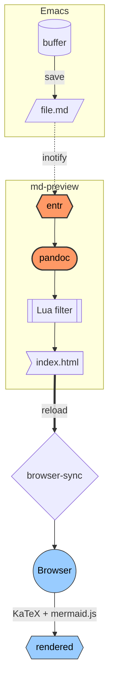
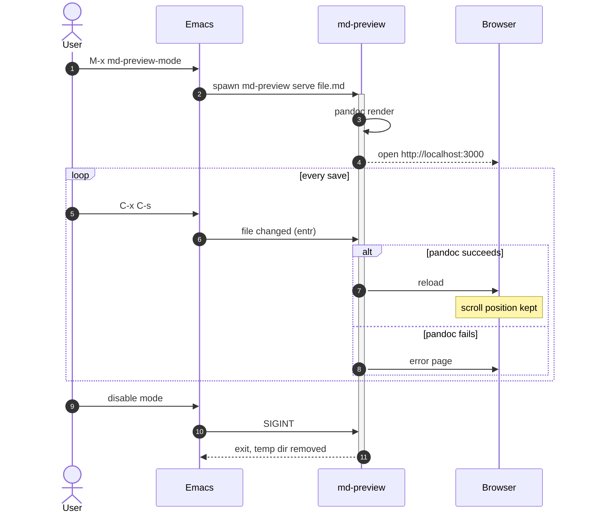
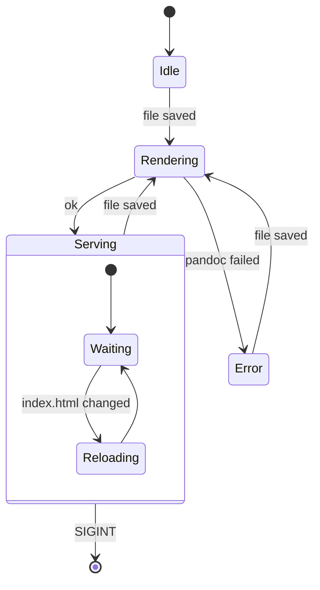
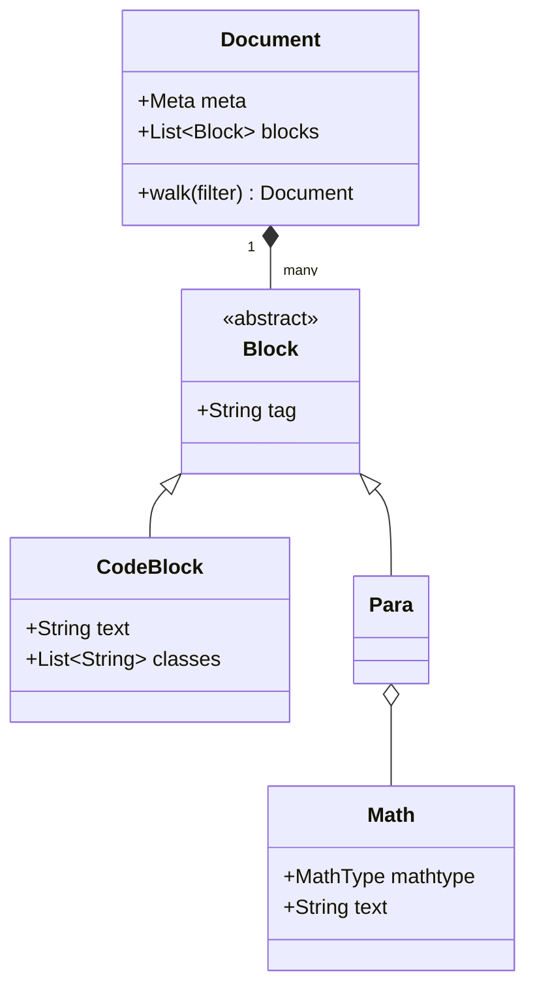
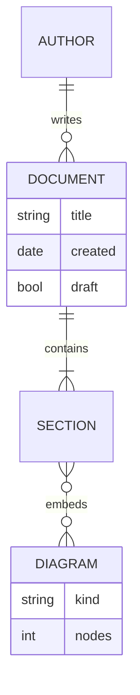
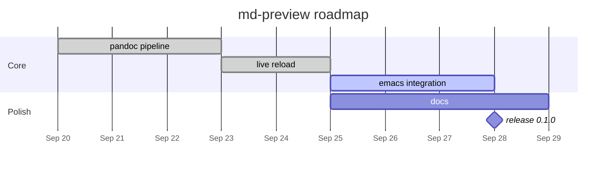
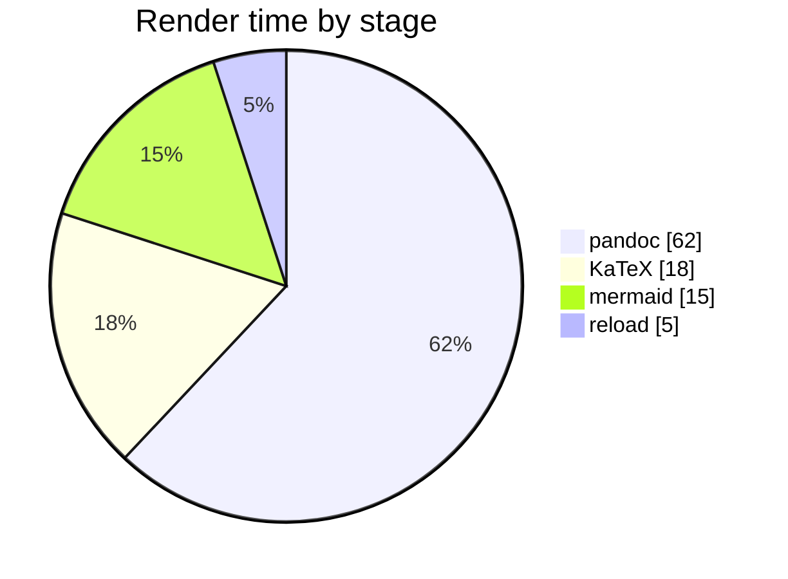
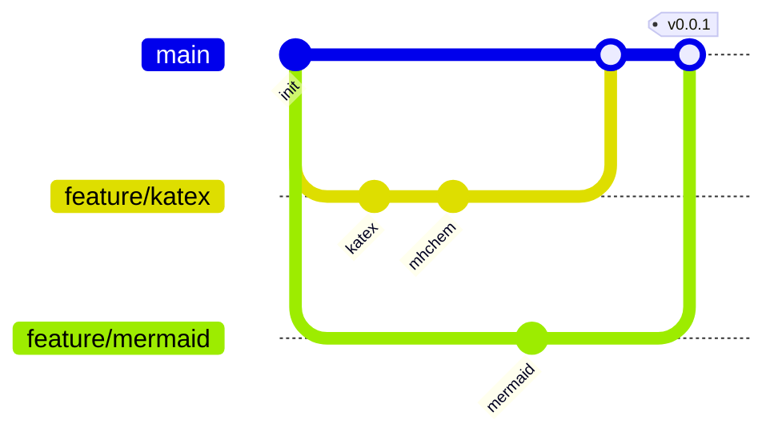
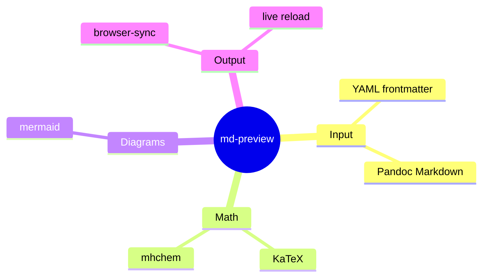
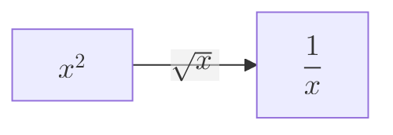

\newcommand{\R}{\mathbb{R}}
\newcommand{\norm}[1]{\left\lVert #1 \right\rVert}
\newcommand{\inner}[2]{\left\langle #1, #2 \right\rangle}

Expect: a collapsed **frontmatter · N keys** box above the title. Opening it
shows every key: nested maps (`build`) as nested tables, lists (`tags`,
`reviewers`) as bullet lists, the boolean `draft` as `true`, and the title with
its italics and math. The title block shows the subtitle, both authors, the date
and the abstract.

# 1 Text formatting

Plain paragraph with *emphasis*, **strong**, ***both***, ~~strikethrough~~,
`inline code`, H~2~O subscript, E = mc^2^ superscript, [highlighted]{.mark}
text, ==marked text==, <kbd>Ctrl</kbd>+<kbd>C</kbd>, a [link](https://pandoc.org),
an autolink <https://katex.org>, and "smart quotes" -- en dash --- em dash...

Emoji shortcodes: :tada: :rocket: :white_check_mark:

A line ending in a backslash\
forces a hard line break.

Expect: all of the above styled; the emoji render as glyphs.

## 1.1 Headings

### Level 3 {#custom-id .unnumbered}

#### Level 4

##### Level 5

###### Level 6

Link to [the custom heading](#custom-id) and to [section 2](#math).

# 2 Math {#math}

## 2.1 Inline math

| Syntax | Source | Rendered |
|--------|--------|----------|
| Dollars | `$\alpha + \beta$` | $\alpha + \beta$ |
| Backslash parens | `\(\gamma^2\)` | \(\gamma^2\) |
| In emphasis | `*$x_i$*` | *$x_i$* |
| Macro from `\newcommand` | `$x \in \R^n$` | $x \in \R^n$ |
| Macro with args | `$\norm{v}$`, `$\inner{u}{v}$` | $\norm{v}$, $\inner{u}{v}$ |

Inline math in running text: the Gaussian $\int_{-\infty}^{\infty} e^{-x^2}\,dx = \sqrt{\pi}$
and a fraction $\frac{a}{b}$ next to $\tfrac{1}{2}$ and $\dfrac{1}{2}$ in a line.

Dollar signs that are **not** math: prices like $20,000 and $30,000 (a
closing dollar must not follow a space) and an escaped \$ sign.
Expect: this paragraph is plain text.

Pitfall: a later dollar in the same paragraph, even inside backticks, can
pair with a price and turn the text between them into math. Escape prices
as `\$20` when a paragraph also contains math.

## 2.2 Display math

Double dollars:

$$
\sum_{k=1}^{n} k = \frac{n(n+1)}{2}
$$

Backslash brackets:

\[
\mathcal{L}(\theta) = -\frac{1}{N}\sum_{i=1}^{N} \log p_\theta(y_i \mid x_i)
\]

A GitHub-style `math` fence:

```math
\nabla \cdot \mathbf{E} = \frac{\rho}{\varepsilon_0}, \qquad
\nabla \times \mathbf{B} - \frac{1}{c^2}\frac{\partial \mathbf{E}}{\partial t} = \mu_0 \mathbf{J}
```

Display math inline with text: $$f(x) = \sum_{n=0}^\infty \frac{f^{(n)}(a)}{n!}(x-a)^n$$
followed by more text in the same paragraph.

## 2.3 LaTeX environments

Bare `align` (numbered):

\begin{align}
  (a + b)^2 &= a^2 + 2ab + b^2 \\
  (a - b)^2 &= a^2 - 2ab + b^2
\end{align}

`align*` (unnumbered), `equation` with a custom tag, and `gather`:

\begin{align*}
  f(x) &= x^2 + 2x + 1 \\
       &= (x + 1)^2
\end{align*}

\begin{equation}
  E = mc^2 \tag{Einstein}
\end{equation}

\begin{gather}
  a = b + c \\
  d = e + f + g
\end{gather}

Cases, matrices and arrays:

$$
|x| = \begin{cases}
  x  & \text{if } x \ge 0 \\
  -x & \text{otherwise}
\end{cases}
\qquad
A = \begin{pmatrix} 1 & 2 \\ 3 & 4 \end{pmatrix}
\quad
B = \begin{bmatrix} a & b \\ c & d \end{bmatrix}
\quad
\det\begin{vmatrix} p & q \\ r & s \end{vmatrix}
$$

$$
\left[\begin{array}{cc|c}
  1 & 0 & 3 \\
  0 & 1 & 4
\end{array}\right]
\qquad
\begin{aligned}
  \dot{x} &= \sigma (y - x) \\
  \dot{y} &= x(\rho - z) - y \\
  \dot{z} &= xy - \beta z
\end{aligned}
$$

## 2.4 KaTeX features

$$
\underbrace{a + b + \cdots + z}_{26}
\quad
\overbrace{1 + 2 + 3}^{6}
\quad
A \xrightarrow[\text{below}]{\text{above}} B
\quad
\cancel{x}\;\bcancel{y}
\quad
\boxed{E = hf}
$$

$$
\operatorname{argmax}_{\theta \in \Theta} \; \mathbb{E}_{x \sim p}\left[\log q_\theta(x)\right]
\qquad
\boldsymbol{\mu} \ne \mu
\qquad
{\color{#d1242f}\text{red}} + \textcolor{#1a7f37}{\text{green}}
\qquad
\mathfrak{g},\ \mathscr{L},\ \mathsf{T},\ \mathtt{mono}
$$

Macro defined on the fly with `\gdef` (shared across the page, KaTeX only):
$\gdef\half{\frac{1}{2}} \half$ and later reused as $\half x^2$.

Chemistry via the `mhchem` extension: $\ce{2H2 + O2 -> 2H2O}$ and
$\ce{CO2 + C <=> 2CO}$, units with $\pu{9.81 m/s^2}$.

Deliberately broken TeX (expect red source text, not a crash): $\frac{1}{$.

## 2.5 Math elsewhere

- In a list item: $\forall \varepsilon > 0\ \exists \delta > 0$
- In a footnote.[^math]
- In a heading: see the next heading.

### Euler's identity $e^{i\pi} + 1 = 0$

> In a blockquote: $$\oint_{\partial \Sigma} \mathbf{B} \cdot d\boldsymbol{\ell} = \mu_0 I$$

[^math]: Footnote math: $\zeta(s) = \sum_{n \ge 1} n^{-s}$.

# 3 Mermaid diagrams

Expect: every block below renders as a diagram (dark theme when the system is
dark), not as source text.

## 3.1 Flowchart with subgraphs, shapes and styles



## 3.2 Sequence diagram with loops, alternatives and notes



## 3.3 State diagram



## 3.4 Class diagram



## 3.5 Entity relationship



## 3.6 Gantt chart



## 3.7 Pie, git graph and mindmap







## 3.8 Math inside a diagram



## 3.9 A normal code block with the word mermaid

Expect: this stays a plain code block (it is not tagged `mermaid`).

```text
graph TD; this is not a diagram --> mermaid
```

# 4 Block elements

## 4.1 Lists

1. First
2. Second
   - nested bullet
   - another
     1. deeply nested
     2. numbered
3. Third

- [x] task done
- [ ] task open
- [ ] task with math $O(n \log n)$

Term one
:   Definition with **formatting**.

Term two
:   First definition.
:   Second definition, with math $a^2 + b^2 = c^2$.

## 4.2 Tables

| Left | Center | Right | Math |
|:-----|:------:|------:|:----:|
| a    | b      | 1.00  | $\pi$ |
| long cell content | c | 22.50 | $\sqrt{2}$ |
| `code` | **bold** | 333.00 | $\infty$ |

: Pipe table with alignment and a caption.

+---------------+----------------------+
| Grid table    | Can hold blocks      |
+===============+======================+
| - a list      | ```                  |
| - in a cell   | code in a cell       |
|               | ```                  |
+---------------+----------------------+

## 4.3 Code with syntax highlighting

```python
from dataclasses import dataclass

@dataclass
class Point:
    x: float
    y: float

    def norm(self) -> float:
        """Euclidean norm."""
        return (self.x ** 2 + self.y ** 2) ** 0.5
```

```bash
#!/usr/bin/env bash
set -euo pipefail
for f in *.md; do
  md-preview build "$f" -o "${f%.md}.html"
done
```

```{.lua .numberLines}
function CodeBlock(cb)
  if cb.classes:includes('mermaid') then
    return pandoc.RawBlock('html', '<pre class="mermaid">' .. cb.text .. '</pre>')
  end
end
```

## 4.4 Quotes and alerts

> A plain blockquote.
>
> > Nested blockquote with *emphasis*.

> [!NOTE]
> Useful information, with math $\lambda$.

> [!TIP]
> Helpful advice.

> [!IMPORTANT]
> Key information.

> [!WARNING]
> Urgent info that needs attention.

> [!CAUTION]
> Negative potential consequences.

## 4.5 Fenced divs, spans and raw HTML

::: {.note}
A pandoc fenced div with class `note`.
:::

This is a [small caps span]{.smallcaps} and [a styled span]{style="color: var(--caution)"}.

<details>
<summary>Raw HTML <code>&lt;details&gt;</code> block (click)</summary>

Markdown **inside** raw HTML, with math $\sum_i x_i$.

</details>

## 4.6 Images

{width=220}

Expect: a blue/green badge reading "md-preview · image ok".

## 4.7 Footnotes

Here is a footnote reference[^1] and an inline one^[Inline footnote text.].

[^1]: A regular footnote, with `code` and a [link](https://pandoc.org).

---

*End of test sample.*
